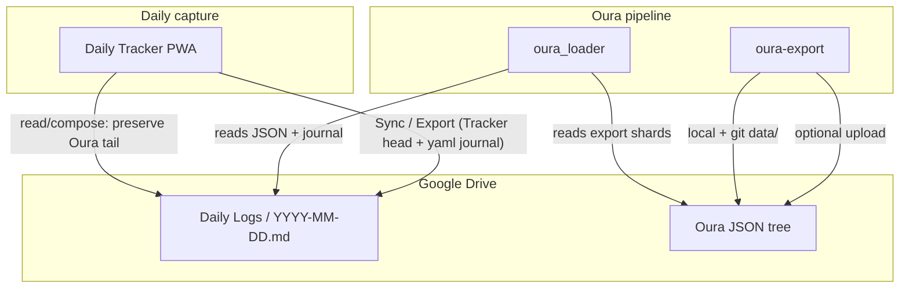

# Personal health tools — ecosystem overview

Four tools work together for daily logging, Oura biometrics, and lab PDFs. This document is the **single map** of what each tool does, how data flows, and **every runtime setting** that affects behavior across repos.

**Spec standard:** [PRODUCT_SPEC_STANDARD.md](PRODUCT_SPEC_STANDARD.md)  
**Integration hub (Oura path):** [oura_loader/docs/INTEGRATION.md](../../oura_loader/docs/INTEGRATION.md)  
**Dual-writer contract (daily `.md`):** [DAILY_LOG_DUAL_WRITER.md](DAILY_LOG_DUAL_WRITER.md)

Recommended clone layout:

```
projects/
  tracker/          ← Daily Tracker PWA
  oura-export/      ← Oura API → JSON
  oura_loader/      ← JSON → wearable block in daily journals
  myLabs/           ← Lab PDFs → CSV (standalone)
```

---

## At a glance

| Tool | Role | Runs where | Primary output |
|------|------|------------|----------------|
| **Daily Tracker** | Capture water, supps, food, other, notes; export/sync daily Markdown | iPhone PWA (browser) | `YYYY-MM-DD.md` on Google Drive + localStorage |
| **oura-export** | Pull Oura API v2 on a schedule | Mac + GitHub Actions | JSON tree under `data/` (+ optional Drive) |
| **oura_loader** | Merge Oura JSON into daily journal files | Mac + GitHub Actions (manual dispatch) | Appends/updates `wearable_biometrics` tail in same `.md` |
| **myLabs** | Parse lab PDFs into canonical CSV | macOS / Windows desktop | `myLabs_<person>_all.csv` beside PDFs |

**myLabs** does not connect to the other three automatically; it is a separate lane for lab results files.

---

## Data flow (Oura + daily journal)



**Division of labor:**

1. **Tracker** writes the **Markdown head** (and ` ```yaml journal ` fence when exported). It **never** calls Oura. On Sync/Export per-day files, it **preserves the Oura tail verbatim** ([dual-writer rules](DAILY_LOG_DUAL_WRITER.md)).
2. **oura-export** downloads **shard JSON** only. Optional post-sync hook can invoke **oura_loader**.
3. **oura_loader** reads export JSON + existing `YYYY-MM-DD.md` on Drive, merges **`wearable_biometrics`**, writes back to Drive. No Oura HTTP in loader.

---

## Daily log file shape

Canonical daily note (simplified):

```
# Tracker narrative / sections (Tracker-owned)

```yaml journal
# structured export from Tracker
```

---
```json
{ "wearable_biometrics": { ... } }
```
```

Exact fence evolution: [daily-log-requirements-v2.md](../../oura_loader/docs/daily-log-requirements-v2.md). Tracker export uses **`yaml journal`**; legacy samples may still show ` ```json ` for the Tracker block.

---

# Tool 1 — Daily Tracker

**Repo:** [familyswink/tracker](https://github.com/familyswink/tracker)  
**Live app:** [familyswink.github.io/tracker](https://familyswink.github.io/tracker)  
**User guide:** [USER_GUIDE.md](USER_GUIDE.md)  
**Product spec:** [PRODUCT_REQUIREMENTS.md](PRODUCT_REQUIREMENTS.md)

### What it does

Offline-first PWA: log supplements (batch Save), food, water, Other activities, notes; optional Google Drive sync and Markdown export; supplement/food protocol management.

### Runtime settings

| Setting | Where | Default | Effect |
|---------|-------|---------|--------|
| **All app data** | `localStorage` key `dt6` | (factory catalog + empty logs) | Single JSON blob: catalog, logs, `S.cfg` |
| **Custom date/time** | Header clock → Set Date & Time; overlay date bar | Off (`S.gdt` null) | New entries use pinned ISO datetime until bottom **Save** clears it |
| **Auto-sync on Save** | Settings → Auto-sync toggle | On | After log commits, upload affected day(s) to Drive with Oura preserve |
| **Share on Export** | Settings toggle | On | iOS Share sheet when exporting |
| **Tab visibility** | Settings → per-tab toggles | All on | Hidden tabs: no new logging UI; data stays on device; omitted from `.md` export |
| **Drive Daily Logs folder ID** | Settings → Drive Settings | Empty until set | Target folder for `YYYY-MM-DD.md` sync |
| **Drive Backups folder ID** | Settings → Drive Settings | Empty until set | `DT_Backup_*.json` full snapshots |
| **Backup saved date** | `S.cfg.backupSavedYmd` | — | Internal: once-per-day backup after Save |
| **Food session marker** | `S.flSave` | null | After Save, food tab shows only entries logged since last Save (daily totals unchanged) |
| **Note wiki hidden/custom** | Settings → Manage [[ names | — | Picker filters only |
| **Supplement qty step** | Manage Supplements → Edit → Qty step | blank → 0.5 | +/- increment in supplement overlay |
| **Supplement track change** | Manage Supplements → Edit → Track in change report | On | Include in day-over-day change report |
| **Food / Other track change** | Manage Food / Manage Other → Edit | Off | Opt-in per item |
| **Change window (hours)** | Settings → Change report window | 4 | Per-log pairing: same qty within N hours of yesterday’s slot ⇒ no supp change |
| **Track water in change report** | Settings toggle | Off | Compare total oz day-over-day |
| **Water quick buttons** | Water → Edit Buttons | 8,16,20,24,32 oz | Quick-add amounts |
| **Service worker cache** | `sw.js` `CACHE` name | bumped each release | Shell cache; `dist/app.js` fetched fresh when online |

**OAuth:** Google Drive uses embedded client id; token in memory ~1h (not in `localStorage`).

**Not persisted:** staged supplement checkboxes (`_supSt`), Other card staging (`_otherSt`), until bottom **Save**.

---

# Tool 2 — oura-export

**Repo:** [familyswink/oura-export](https://github.com/familyswink/oura-export)  
**User guide:** [README.md](../../oura-export/README.md)  
**Product spec:** [product-spec.md](../../oura-export/docs/product-spec.md)

### What it does

CLI + GitHub Actions: fetch Oura API v2 → write merged `daily/`, resource dirs, `_manifest.json` under `output_root`; optional **git commit**, **Google Drive upload**, **oura_loader** journal injector hook.

### Sink order (code)

1. **Local** write JSON  
2. **Git commit** (optional) — stages `data/` *before* Drive in the same run  
3. **Google Drive** upload (uses/updates `_drive_manifest.json`)  
4. **Journal injector** subprocess (optional)

Commit **`data/_drive_manifest.json`** to git so Drive uploads reuse file ids.

### Runtime settings (operator)

| Setting | Where | Default | Effect |
|---------|-------|---------|--------|
| **Config file** | `OURA_EXPORT_CONFIG` or `config.local.yaml` | `config.local.yaml` | YAML root: timezone, output_root, sync, sinks, journal_injector |
| **Sync mode** | YAML `sync.mode` / `OURA_EXPORT_SYNC_MODE` | `incremental` | `incremental` vs `backfill` |
| **Lookback days** | YAML / env / GH variable | `7` | Incremental window length |
| **Start date** | YAML / env | — | Required for backfill |
| **Exclude endpoints** | YAML list + `OURA_EXPORT_EXCLUDE_ENDPOINTS` | CI excludes 6 endpoints | Skips Oura API calls for listed resources |
| **sinks.local** | YAML | true in examples | Must be true for Drive today |
| **sinks.google_drive** | YAML + secrets | CI on | Upload to folder id + path |
| **sinks.git_commit** | YAML + `OURA_EXPORT_GIT_COMMIT` | CI on | Commit `data/` after local write |
| **OURA_EXPORT_GIT_PUSH** | env / GH variable | true in CI | Push after commit |
| **OURA_EXPORT_DRIVE_FULL_SYNC** | env | false | Re-upload entire `data/` tree |
| **Oura auth** | `.env` PAT or OAuth refresh | — | `OURA_PERSONAL_ACCESS_TOKEN` or client id/secret/refresh |
| **Google auth** | `.env` or `.google/token.json` | — | Drive upload credentials |
| **OURA_GOOGLE_DRIVE_ID_BAS** | secret | — | Drive parent folder |
| **Journal injector** | YAML `journal_injector` + env | off in CI by default | Runs `oura_loader` after sync; see README |
| **OURA_EXPORT_JOURNAL_INJECTOR_CI** | workflow YAML only | `"false"` | Must edit workflow to enable injector on GitHub |
| **CLI** | `oura-sync` | — | `--dry-run`, `--skip-journal-injector`, `-v`, `--mode`, `--start-date` |

---

# Tool 3 — oura_loader

**Repo:** [familyswink/oura_loader](https://github.com/familyswink/oura_loader)  
**User guide:** [USER_GUIDE.md](../../oura_loader/docs/USER_GUIDE.md)  
**Product spec:** [PRODUCT_SPEC.md](../../oura_loader/PRODUCT_SPEC.md)

### What it does

**Drive-only** injector: for each date, read `sleep/{date}.json` + `daily/{date}.json` (+ optional heartrate), read/write `YYYY-MM-DD.md` in Tracker’s Drive journal folder, apply **Absent / Missing / Overwritten / Synced** lifecycle with fingerprint staleness detection.

**Production path:** `python oura_journal_injector.py` locally or **workflow_dispatch** `oura_journal_injector_dispatch.yml`. There is **no** committed `daily-logs/` git workflow.

### Runtime settings

| Setting | Where | Default | Effect |
|---------|-------|---------|--------|
| **Google OAuth** | `GOOGLE_CLIENT_*` or `GOOGLE_OAUTH_DIR` | — | Required |
| **Export Drive root** | `OURA_GOOGLE_DRIVE_ID_BAS` (+ optional `FOLDER_BAS` / path) | — | Where Oura JSON shards live |
| **Journal leaf folder** | `TRACKER_LOADER_GOOGLE_DRIVE_JOURNAL_LEAF_FOLDER_ID` | — | **Preferred** — direct id of Daily Logs folder |
| **Journal path mode** | `TRACKER_LOADER_GOOGLE_DRIVE_ID_BAS` + `FOLDER_BAS` | — | Walk path under parent if leaf id unset |
| **Allow mkdir** | `TRACKER_LOADER_GOOGLE_DRIVE_JOURNAL_ALLOW_MKDIR` | off | Create missing folders on Drive |
| **Timezone** | `OURA_LOADER_TZ` | `UTC` | Default date window |
| **Lookback** | `OURA_LOADER_LOOKBACK_DAYS` | `7` | Default rolling window when no dates passed |
| **CLI `--date`** | flag | — | Single day |
| **`--start-date` / `--end-date`** | flags | — | Inclusive range |
| **`--discovery-all`** | flag | — | All `YYYY-MM-DD.md` stems **on Drive** in journal folder |
| **`--dry-run`** | flag | — | Classify only |
| **`--force-refresh`** | flag | — | Rewrite even if synced |
| **GH workflow mode** | `OURA_LOADER_SYNC_MODE` | `incremental` | `backfill` uses `OURA_LOADER_START_DATE` → today |

**Exit codes:** 0 ok · 10 I/O lock · 11 parse/splice · 12 config/auth

---

# Tool 4 — myLabs

**Repo:** [familyswink/myLabs](https://github.com/familyswink/myLabs) — **local git initialized**; create private GitHub repo and `git remote add origin … && git push -u origin main` when ready  
**User guide:** [USER_GUIDE.md](../../myLabs/USER_GUIDE.md)  
**Product spec:** [PRODUCT_SPEC.md](../../myLabs/PRODUCT_SPEC.md)

### What it does

Flet desktop app: browse folder of PDFs (Quest, LabCorp, Boston Heart, Apple Health), optional rename, **Migrate labs** → merge into per-person CSV + optional YAML/Markdown exports beside PDFs.

### Runtime settings

| Setting | Where | Default | Effect |
|---------|-------|---------|--------|
| **Household profiles** | `~/Library/Application Support/myLabs/profiles.json` (macOS) | — | Required: who labs belong to |
| **Export format prefs** | `export_preferences.json` | CSV on; YAML/MD off | Footer checkboxes |
| **Canonical mapping (global)** | `myLabs_test_mapping_user.csv` in app data dir | seeded from bundled | Test name normalization |
| **Optimal/description mapping** | `myLabs_optimal_description_mapping_user.csv` | bundled seed | Reference ranges copy |
| **Per-folder merge store** | `myLabs_<slug>_all.csv` next to PDFs | — | Full history merge target |
| **Latest / report exports** | same folder | — | Snapshot files per run |
| **Rename journal** | `rename_journal.jsonl` in app data | — | Undo rename |
| **Restore Defaults** | UI button | — | Reset bundled mappings |
| **Sort mode** | code constant `CSV_SORT_MODE` | `alphabetical` | CSV row ordering |

No environment variables. No cloud sync built-in.

---

## Typical daily operator sequence

1. **Throughout the day:** Tracker on phone — log water/food/other immediately; stage supps; pin date/time from header or overlay bar if backfilling.
2. **End of session:** Tracker bottom **Save** → auto-sync today’s `.md` to Drive (Oura tail preserved if present).
3. **Overnight (automated):** GitHub **oura-export** workflow runs → JSON to `data/` + Drive + git commit/push.
4. **Optional / manual:** Run **oura_loader** injector (local or Actions dispatch) → refresh wearable blocks in Drive journals for last N days.
5. **Occasionally:** **myLabs** — drop new lab PDFs in folder, pick household member, **Migrate labs**.

---

## GitHub status checklist

| Repo | Remote | Notes |
|------|--------|-------|
| tracker | `familyswink/tracker` | PWA deploy via `main` → GitHub Pages |
| oura-export | `familyswink/oura-export` | Commit `data/_drive_manifest.json` |
| oura_loader | `familyswink/oura_loader` | Smoke + manual injector workflows |
| myLabs | Init locally; create `familyswink/myLabs` if missing | Private repo recommended (health PDFs) |

---

## Where to edit when something changes

| Change | Edit |
|--------|------|
| Tracker export / Sync / Oura tail | `tracker/docs/DAILY_LOG_DUAL_WRITER.md`, `tracker/docs/PRODUCT_REQUIREMENTS.md` |
| Wearable JSON schema / lifecycle | `oura_loader/PRODUCT_SPEC.md` |
| Oura fetch / JSON layout | `oura-export/docs/product-spec.md` |
| Daily note UX / Obsidian | `oura_loader/docs/daily-log-requirements-v2.md` |
| Cross-repo cascade | `oura_loader/docs/REQUIREMENTS_CHANGELOG.md` |
| This map | `tracker/docs/ECOSYSTEM.md` |
